# 多功能可交互时钟

## 需求
- 时钟：
  秒针平滑移动，通过参数设置时间，拖动指针来调整时间
- 闹钟
- 秒表
- 计时器
## 分工
- 刘怿轩：页面元素CSS交互式设计
- 贾云哲：框架搭建和各模块基础性功能
- 王赫：页面布局和样式的CSS设计
- 翁汇坤：各模块额外功能完善
## 实现思路
注：javascript代码文件中有详细的注释，以供参考。
### 一、时钟
#### SVG绘制时钟
- 使用circle标签绘制时钟表盘，使用line标签绘制指针和刻度 
- 使用g标签将表盘上的数字和刻度分别组织在一起，并设置g标签的transform属性以统一将数字和刻度的参考点移动到表盘中心处
#### 时钟转动和显示功能
- 使用setInterval函数每0.1秒调用一次updateClock函数，以使时钟能随时间转动和改变显示
- updateClock函数中进行如下操作：
  - 根据Date对象的getTime方法获取当前时间
  - 根据当前时间计算时、分、秒针的角度，改变指针html元素的transform属性，使指针指向正确位置
  - 根据当前时间计算时、分、秒，改变元素的textContent属性显示时间文本
#### 秒针的平滑移动
秒针的平滑移动得益于以下两方面：
- 使用setInterval函数0.1秒调用一次updateClock函数，使得感官上秒针每时每刻都在转动
- 在updateClock函数中计算当前时间并改变秒针角度时，额外考虑了当前时间的毫秒数，使得秒针每次转动的角度变化显得连续
#### 通过参数进行时间设置
- 设置全局变量delta_date，表示待显示时间和当前时间的时间差
- 每0.1秒调用updateClock函数时，考虑delta_date进行时、分、秒的计算，即可显示任意时间
#### 拖动指针进行时间设置
- 调用addEventListener函数为时、分、秒针分别添加鼠标点击和拖动事件监听器
- 鼠标按下指针后调用clearInterval函数停止时钟刷新
- 鼠标拖动指针时，根据鼠标和时钟中心的位置计算被拖动指针的所在角度
- 综合考虑当前显示的时间、被拖动指针的角度，设置全局变量delta_date的值，并调用updateClock函数刷新显示。 
  这里的综合考虑较为复杂：
  - 若拖动的是时针，则需要考虑小时显示的是0时至11时之间，还是12时至23时之间。例如0点整和12点整，时钟的表盘显示都是一样的，但文本显示却不同。
  - 若拖动的是分针，则其一需要实现时针跟着分针动；其二需要考虑分针向前或向后经过12刻度，小时退位和进位的问题。
  - 若拖动的是秒针，则其一需要实现时针和分针都跟着秒针动；其二也需要考虑秒针向前或向后经过12刻度，分钟退位和进位的问题。
  
  以上考虑通过一系列的条件判断来实现，其中时针跟着分针动、时针和分针都跟着秒针动的效果可以直接通过设置delta_date的值自然达成。
### 二、闹钟
#### 闹钟时间和名称编辑
- 对每个闹钟模块添加鼠标点击事件监听器，当点击时在主体grid标签的classList中添加.show类，而.show类的样式在CSS文件中定义，使页面显示编辑框；当需要关闭编辑框时，再从grid的classList中移除.show类即可。
- 点开编辑框时会储存鼠标点击的闹钟模块对象，同时编辑框中的input标签的value属性会显示当前闹钟模块的时间和名称；点击保存按钮时，将编辑框中input标签的value属性赋给当前闹钟模块的相应属性，并关闭编辑框。
#### 闹钟的开关功能
- 在页面上显示的开关是主要是用`type=''checkbox''`的input标签完成的，当点击开关时会触发change事件。
- 在change事件的响应函数中，进行以下两个操作：
  - 在对应闹钟模块的classList中添加或移除.checked类，而.checked类的样式在CSS文件中定义；
  - 在储存所有闹钟模块是否开启的数组isCheckedArray中，根据当前点击的开关状态更新对应闹钟模块的开启状态。
#### 闹钟的定时提醒功能
- 使用setInterval函数每1秒调用一次checkAlarms函数，以动态监测可能刚刚设置的闹钟
- checkAlarms函数依次检查isCheckedArray的所有元素，如果闹钟开启且时间到达，则触发闹钟提醒，并关闭该闹钟以防重复提醒。
#### 闹钟的添加和删除功能
- 容纳闹钟模块的元素采用grid布局
- 调用cloneNode函数，将在HTML文件和CSS文件中定义的闹钟模板备份，以保留其中的子孙元素和CSS样式
- 点击添加按钮时，克隆已备份的模板得到新的闹钟对象，根据grid布局计算其位置并显示
- 点击删除按钮时，一方面从父元素中将对应闹钟模块删除，然后陆续调整后续闹钟的布局；另一方面更新isCheckedArray数组，删除对应索引的元素。
### 三、秒表
#### 秒表计时功能
- 全局变量储存以下信息：开始计时的时间点、经过的时间段。
- 点击启动按钮时，记录开始计时的时间点，并调用setInterval函数每10毫秒调用一次updateStopwatch函数
- updateStopwatch函数进行如下操作：
  - 计算当前时间点和开始计时的时间点的差值，得到经过的时间段
  - 设置文本显示经过的时间段
  - 更新时钟表盘显示经过的时间段
- 点击停止按钮时，调用clearInterval函数停止计时，并保存经过的时间段，以备后续再次点击启动按钮时设置开始计时的时间点。
#### 秒表的分段功能
该功能在例如记录跑步、骑车等运动时会使用。
- 新增全局变量储存上一次记录距开始的时间段
- 点击分段按钮时，利用储存的全局变量显示总经过的时间段和距离上一次记录的间隔，并通过grid布局显示在页面上
#### 秒表的复位功能
- 点击复位按钮时，将全局变量和页面显示都恢复到初始状态。
### 四、计时器
计时器的时间名称编辑、添加和删除的功能实现和闹钟类似，这里不再赘述。
#### 计时器的倒计时功能
- 在更改计时器时需要维护的三个数组如下：储存所有计时器的设定时间、储存所有计时器的剩余时间、储存所有计时器的定时器
- 当计时器被打开时，为该计时器创建一个定时器，调用setInterval函数每10毫秒更新一次剩余时间，并将剩余时间和定时器存储在相应的数组中
- 当计时器被暂停时，调用clearInterval函数清除对应的定时器
- 当计时器被重置时，利用已储存的设定时间将显示和变量都恢复初始状态
#### 计时器放大显示功能
- 在CSS中预先设置.enlarged类样式和动画
- 通过设置backgroundImage属性为conic-gradient并调整颜色和度数参数实现渐变效果
- 当点击放大按钮后，在计时器元素的classList中添加.enlarged类以显示放大界面
- 根据计时器的总计时和当前剩余时间，改变conic-gradient的角度参数以实现放大界面的倒计时动画
- 无论放大与否，计时器的倒计时功能行使如常

## 用法说明
入口为index.html，通过点击左侧导航栏来切换不同功能的页面，并且左侧导航栏可以通过上方的按钮来展开/缩回，默认打开时右边显示时钟页面。
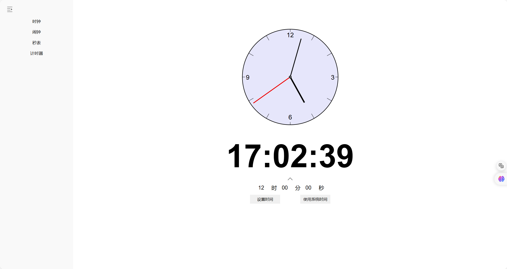
- 时钟部分 
  时钟页面里，中间是时钟主体，下面是数字形式显示的当前时间，最下方是通过数字输入框来调整时间的部分，并且这部分也可以展开/缩回。时钟的秒针平滑转动，并可以通过参数输入或鼠标拖动指针来调整时间，也可以选择显示系统时间。

- 闹钟部分 
  闹钟页面整体采用grid布局方式，支持添加和使用多个闹钟，并且可以设置闹钟的名称、时间以及每个闹钟的开关状态。
  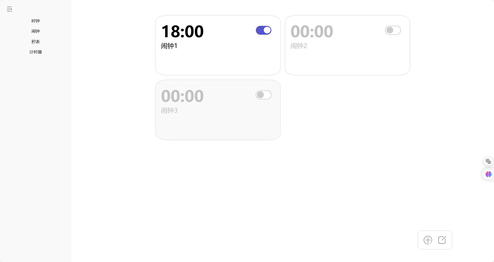
  点击一个闹钟，可以进入闹钟编辑页面，可以设置闹钟的名称、时间，点击右上角按钮可以删除该闹钟。
  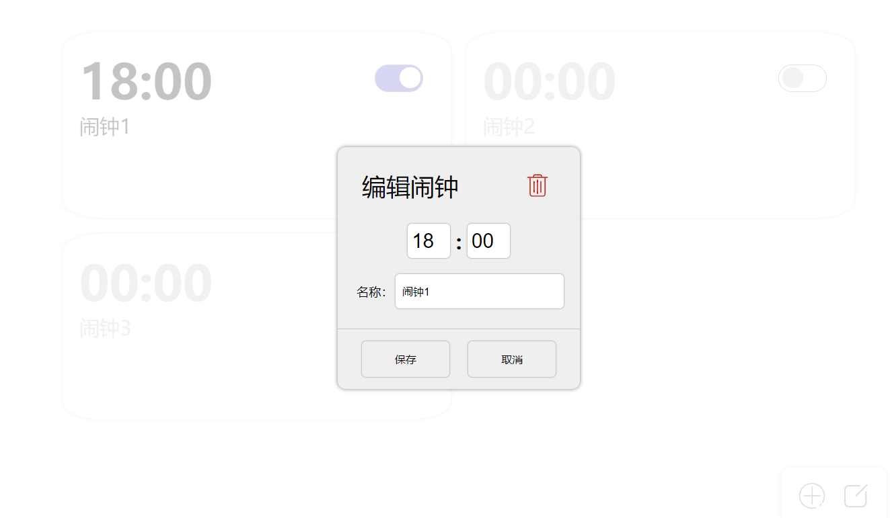
  右下角的两个按钮用于添加新的闹钟和批量删除闹钟。
  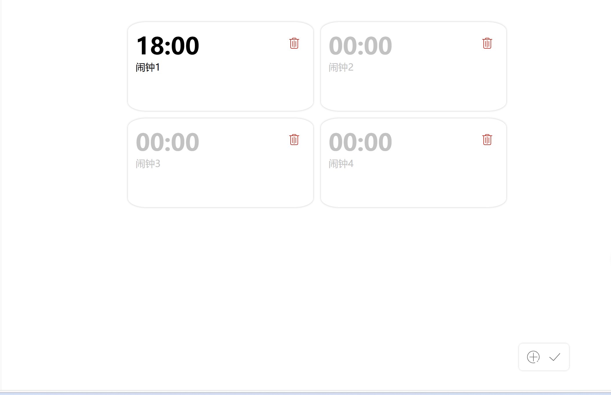
  当时间到达所设定的闹钟时间时，会触发警告栏弹出提醒。
  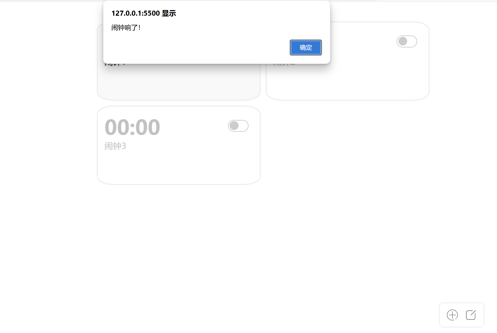

- 秒表部分 
  秒表页面的表盘复用了时钟页面的表盘，可以点击启动按钮来开始计时，计时期间可以通过另一个按钮记录时间，实现秒表的分段功能，下方的显示栏会依次显示记录的时间。
  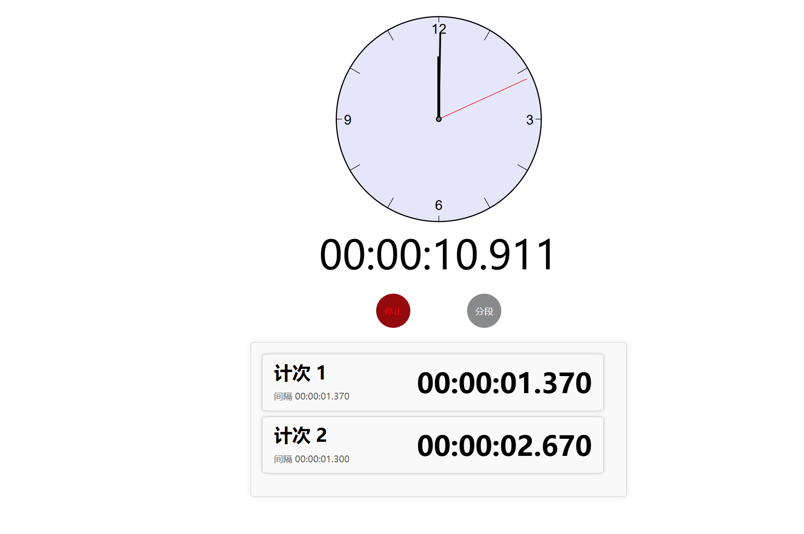
  在计时期间点击停止按钮，可以暂停计时，同时另一个按钮变为复位按钮。此时点击启动按钮会从上次记录的时间继续开始计时，点击复位按钮会将秒表计时和显示栏都清零。
  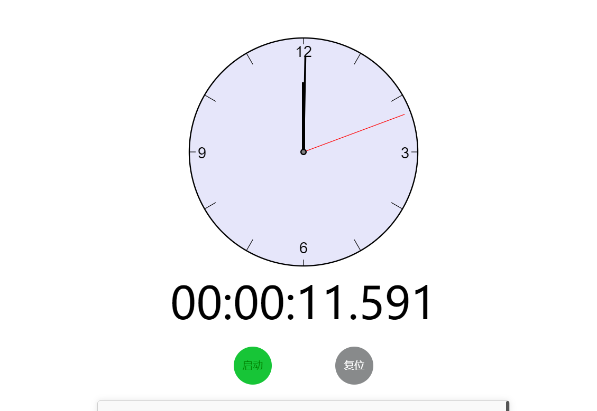

- 计时器部分 
  计时器页面和闹钟页面的整体布局类似，同样支持多个计时器，可以设置每个计时器的名称、时间和全屏显示状态。
  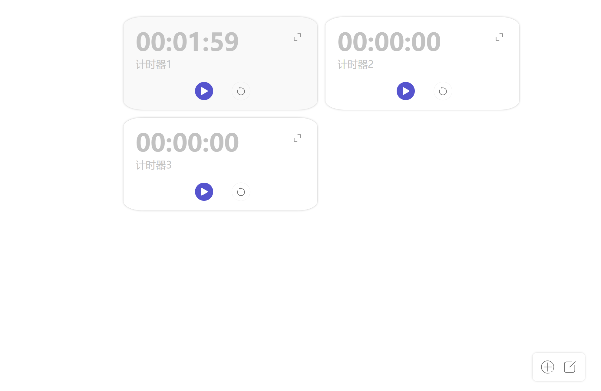
  点击一个计时器，可以进入计时器编辑页面，可以设置计时器的名称、时间，点击右上角按钮可以删除该计时器。
  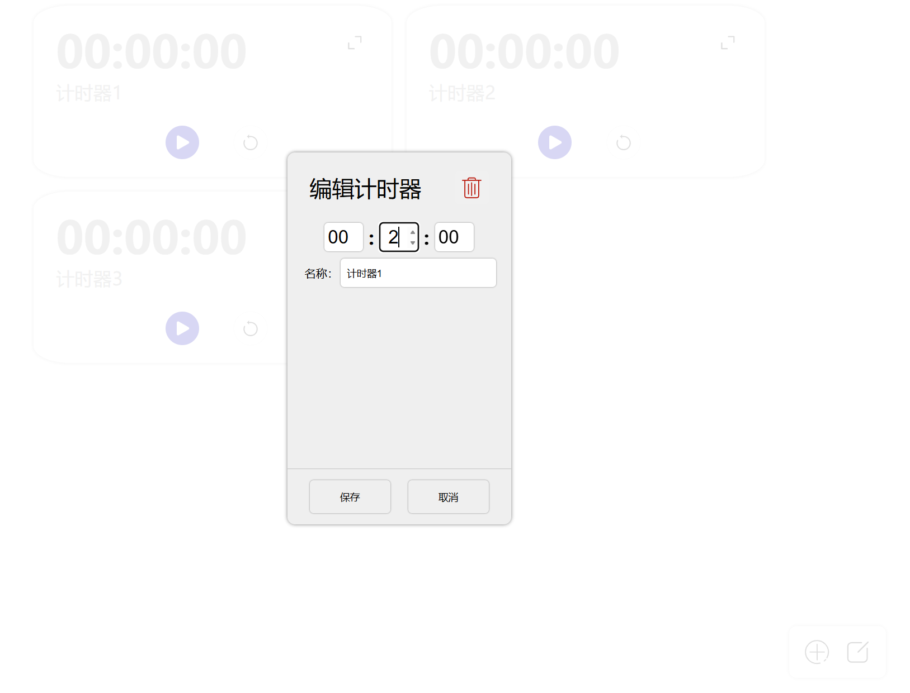
  点击一个计时器右上方的放大按钮，可以全屏显示计时器，更加精确的看到倒计时的情况。 
  点击重置按钮，会将该计时器恢复到所设置的初始状态。
  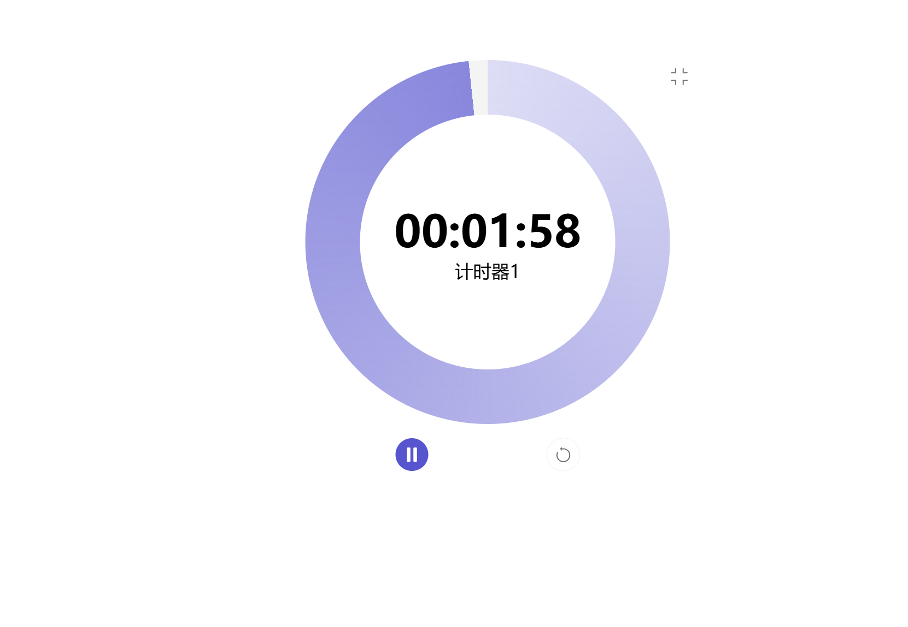
  当计时器的倒计时时间到达0时，会触发警告栏弹出提醒。
  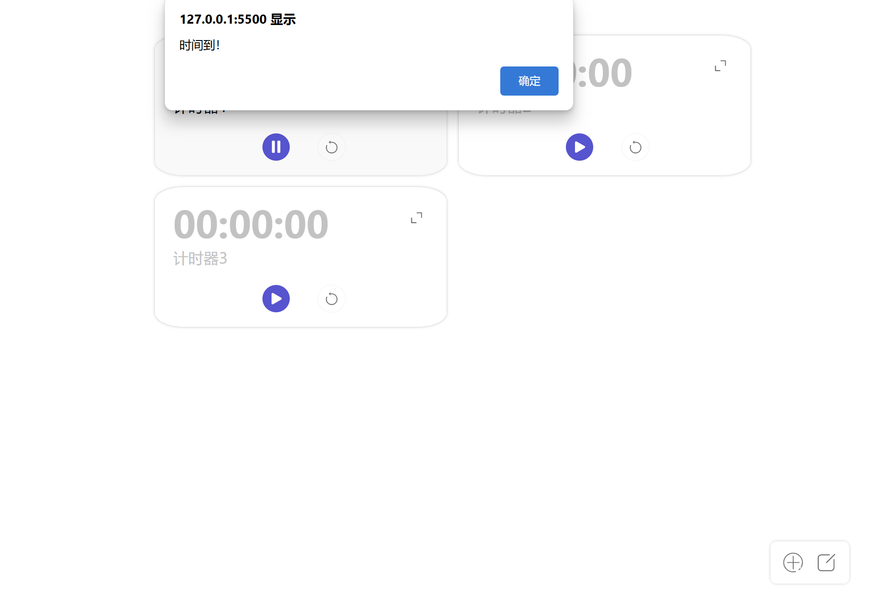
