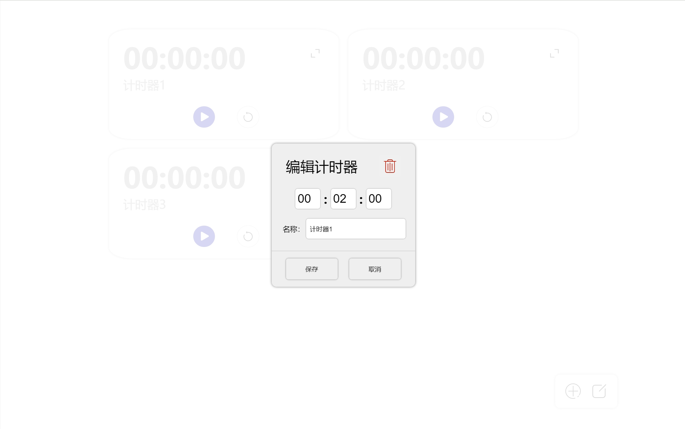

# 多功能可交互时钟

## 需求
- 时钟
  秒针平滑移动，通过参数设置时间，拖动指针来调整时间
- 闹钟
- 秒表
- 计时器
## 分工
- 刘怿轩：页面元素CSS交互式设计
- 贾云哲：框架搭建和各模块基础性功能
- 王赫：页面布局和样式的CSS设计
- 翁汇坤：各模块额外功能完善
## 实现思路
- 时钟
使用circle标签、line标签来绘制表盘、指针和刻度。并使用g标签将表盘上的数字和刻度分别组织在一起，并设置g标签的transform属性以统一将数字和刻度的参考点移动到表盘中心处。
  - 至于秒针的平滑移动，需要在updateClock函数中不断更新指针的旋转角度，考虑当前时间的毫秒数，并且每100ms调用一次updateClock函数更新指针的位置,使得秒针达到平滑移动的效果。
  - 通过输入参数设置时间，计算输入时间与当前时间的差值delta_date，每0.1秒调用updateClock函数时，考虑delta_date进行时、分、秒的计算，即可显示任意时间并且保证秒针的平滑移动。
  - 拖动指针调整时间，

- 闹钟

- 秒表
  
- 计时器
## 用法说明
入口为index.html，通过点击左侧导航栏来切换不同功能的页面，并且左侧导航栏可以通过上方的按钮来展开/缩回，默认打开时右边显示时钟页面。

- 时钟部分
  时钟页面里，中间是时钟主体，下面是数字形式显示的当前时间，最下方是通过数字输入框来调整时间的部分，并且这部分也可以展开/缩回。时钟的秒针平滑转动，并可以通过鼠标拖动指针来调整时间。

- 闹钟部分
  闹钟页面整体采用grid布局方式，支持添加多个闹钟，并且可以设置闹钟的名称、时间以及每个闹钟的开关状态。
  
  点击一个闹钟，可以进入闹钟设置页面，可以设置闹钟的名称、时间。
  
  右下角的两个按钮用于添加新的闹钟和批量删除闹钟。
  
  当时间到达所设定的闹钟时间时，会触发警告栏弹出提醒。
  

- 秒表部分
  秒表页面的表盘复用了时钟页面的表盘，可以点击启动按钮来开始计时，计时期间可以通过另一个按钮记录时间，实现秒表的分段功能，下方的显示栏会依次显示记录的时间。
  

- 计时器部分
  计时器页面和闹钟页面的整体布局类似，同样支持多个计时器，可以设置每个计时器的名称、时间和全屏显示状态。
  
  点击一个计时器，可以进入计时器设置页面，可以设置计时器的名称、时间。
  
  点击一个计时器右上方的放大按钮，可以全屏显示计时器，更加精确的看到倒计时的情况。
  
  当计时器的倒计时时间到达0时，会触发警告栏弹出提醒。
  